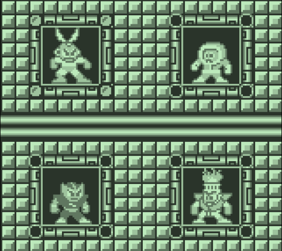

Gameboy emulator written in Golang and Ebiten

# Online demo

Player in a browser:
https://kazzmir.itch.io/gameboy

# Build

Extra packages needed for ebiten
https://ebitengine.org/en/documents/install.html

```
$ go mod tidy
$ go build -o gameboy ./emulator
```
or
```
$ make
```

# Screenshots

